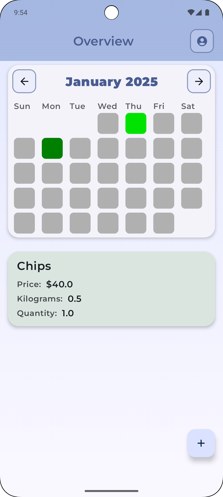
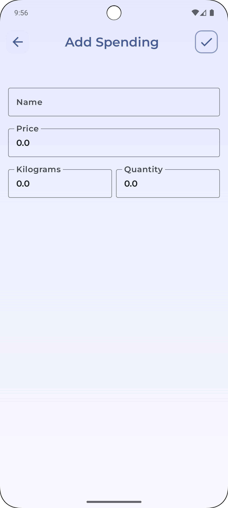

# Budget Tracker

## Overview
The Kotlin Spending Tracker app is a cross-platform application designed to help users track their spending, visualize financial data, and synchronize it seamlessly across devices. By utilizing Jetpack Compose for an intuitive UI, Room for efficient local data storage, and AWS Aurora for robust cloud synchronization, this app ensures a smooth and reliable user experience both online and offline.





---

## Features

### Core Features:
- **Track Spending:** Log and categorize your expenses with ease.
- **Data Visualization:** View your spending trends through interactive graphs and charts.
- **Offline Support:** Automatically save data locally using Room when offline.
- **Cloud Synchronization:** Upload data to AWS Aurora whenever an internet connection is available.
- **Cross-Platform Compatibility:** Synchronize your data across devices seamlessly.

### Additional Highlights:
- **Secure and Reliable:** Robust backend powered by AWS Aurora ensures data integrity and security.
- **Modern UI:** Built with Jetpack Compose for a clean and intuitive user interface.
- **Local Storage:** Room ensures quick and offline access to your spending data.

---

## Tech Stack

### Frontend
- **Language:** Kotlin
- **UI Framework:** Jetpack Compose

### Backend
- **Database:** Room (local storage)
- **Cloud Database:** AWS Aurora
- **APIs:** Custom REST APIs for cloud data synchronization

### Cross-Platform Integration
- AWS Aurora supports seamless data access and synchronization across multiple devices.

---

## Installation

### Prerequisites
- **Android Studio:** Ensure you have the latest version installed.
- **AWS Account:** Configure your AWS credentials for Aurora access.
- **Kotlin Version:** Ensure Kotlin is set up in your environment.

### Steps
1. Clone the repository:
   ```bash
   git clone https://github.com/peterzdhuang/BudgetTracker
   ```
2. Open the project in Android Studio.
3. Sync Gradle dependencies.
4. Configure your AWS credentials in the `res/values/secrets.xml` file.
5. Build and run the project on your preferred emulator or device.

---

## Usage

### Initial Setup
1. Launch the app and set up your profile.
2. Start logging your expenses and assign categories.

### Offline Mode
- Expenses are stored locally using Room when there is no internet connection.

### Online Mode
- The app automatically syncs with AWS Aurora to back up your data and ensure cross-platform availability.

---

## Configuration

### AWS Aurora
1. Set up an AWS Aurora PostgreSQL instance.
2. Configure the backend API endpoint to connect to your Aurora database.
3. Ensure the app has the correct IAM permissions for accessing Aurora.

### API Keys
Store sensitive API keys and credentials in a secure manner (e.g., encrypted environment variables or secrets management tools).

---

## Contributing

### Guidelines
1. Fork the repository.
2. Create a feature branch:
   ```bash
   git checkout -b feature/<feature-name>
   ```
3. Commit changes and push to your fork.
4. Open a pull request.

---

## Contact
For inquiries or support, please reach out to peterzdhuang@gmail.com

